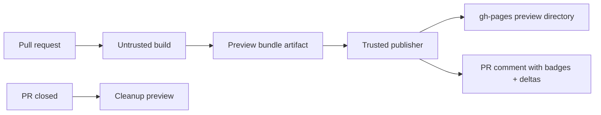

# storybook-github-pages

[](https://github.com/Archetipo95/storybook-github-pages/actions/workflows/ci.yml)
[](https://opensource.org/licenses/MIT)

Deploy Storybook to GitHub Pages with secure reusable workflows, PR previews, badges, coverage stats, and growth graphs.

> See [Archetipo95/storybook-vue-demo](https://github.com/Archetipo95/storybook-vue-demo) for a live Vue 3 + Storybook 10 example.

## Why use it?

- **One workflow for Storybook Pages**: build, validate, upload, and deploy static Storybook output.
- **Secure by default**: least-privilege jobs, SHA-pinned actions, artifact validation, fork-safe PR preview publishing.
- **Preview every PR**: untrusted build job + trusted publisher, stale-run protection, bot comments, cleanup, and janitor.
- **Visible project health**: generated SVG badges for Storybook version, stories, components, component coverage, tests, build, and publish status.
- **Trend graph**: `stats/history.svg` and `stats/history.json` track Storybook growth over time.
- **Migration-friendly**: compatible with common `bitovi/github-actions-storybook-to-github-pages` inputs.

## Quickstart

```yaml
name: Deploy Storybook

on:
  push:
    branches: [main]

permissions:
  contents: read
  pages: write
  id-token: write

jobs:
  deploy-storybook:
    uses: Archetipo95/storybook-github-pages/.github/workflows/deploy-storybook.yml@v1.9.13
    with:
      path: 'storybook-static'
      package_manager: 'npm'
      build_command: 'npm run build-storybook'
```

Need a custom pipeline or branch-backed directory deploy? See [Usage](docs/usage.md).

## What you get on your Pages site

Enable the defaults and the action publishes these alongside Storybook:

```md
[](https://<owner>.github.io/<repo>)
[](https://<owner>.github.io/<repo>)
[](https://<owner>.github.io/<repo>)
[](https://<owner>.github.io/<repo>)
[](https://<owner>.github.io/<repo>)
```

Also generated:

- `badges/overview.json` — full Storybook metrics endpoint.
- `stats/history.svg` — hand-drawn growth chart.
- `stats/history.json` — historical metrics ledger.

See [Badges and stats](docs/badges-and-stats.md).

## PR previews

Use the PR preview lifecycle to publish preview Storybooks safely:



See [PR previews](docs/pr-previews.md).

## Documentation

| Need                                                     | Read                                         |
| -------------------------------------------------------- | -------------------------------------------- |
| Turnkey deploy, composite action, directory mode, inputs | [Usage](docs/usage.md)                       |
| Badges, component coverage, growth chart                 | [Badges and stats](docs/badges-and-stats.md) |
| PR preview build/publish/cleanup/janitor                 | [PR previews](docs/pr-previews.md)           |
| Permissions and security model                           | [Security](docs/security.md)                 |
| Bitovi migration                                         | [Migration](docs/migration.md)               |
| Vite/Rollup/Webpack subdirectory previews                | [Modern bundlers](docs/bundlers.md)          |
| Common failures                                          | [Troubleshooting](docs/troubleshooting.md)   |
| Tests, coverage, release checklist                       | [Development](docs/development.md)           |

## Security note

The optional passcode gate is only casual client-side privacy. Static assets remain public on GitHub Pages. Use an authenticated hosting layer for confidential Storybooks.

## License

MIT. See [LICENSE](LICENSE).
